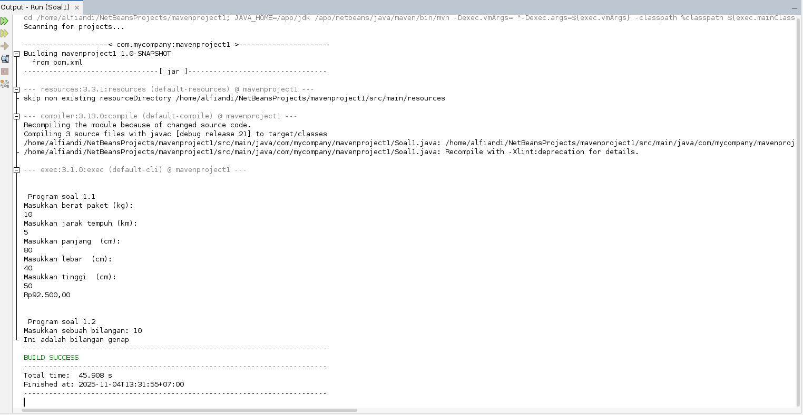
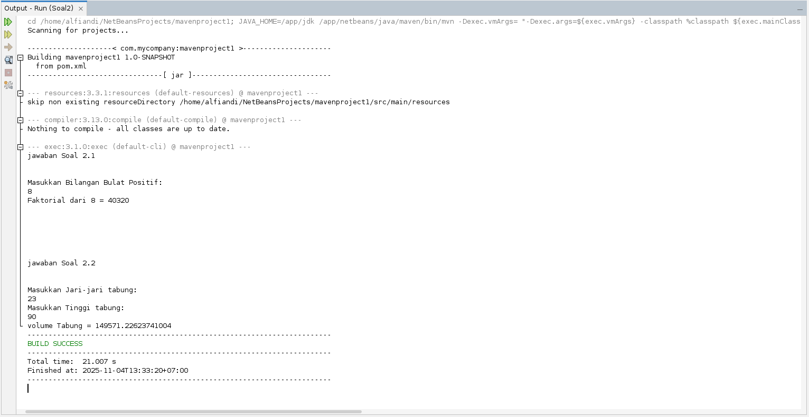
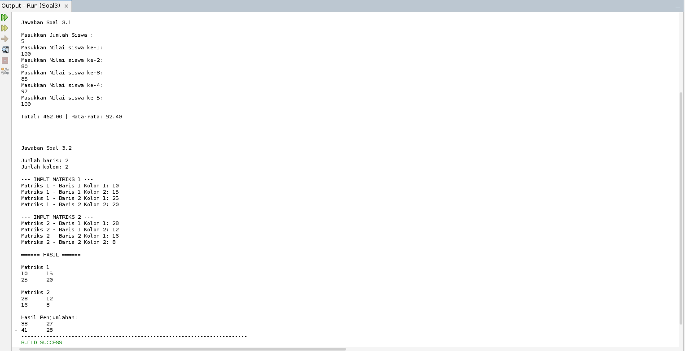

# Program Java: Latihan Ujian Kenaikan Level

---

## `Soal1`
**Kalkulator Biaya & Pemeriksa Bilangan Genap/Ganjil**

Program ini menggabungkan dua fungsionalitas: kalkulator biaya pengiriman paket yang dinamis dan utilitas sederhana untuk memeriksa paritas angka. (Diimplementasikan dalam `Soal1b1.java` dan `Soal1b2.java`).

### Fungsi Program

* **Kalkulator Biaya Pengiriman (Bagian A - `Soal1b1.java`):**
    * Menghitung total biaya pengiriman berdasarkan **berat** paket, **jarak** tempuh, dan **dimensi** (panjang, lebar, tinggi).
    * Menerapkan logika tarif berjenjang:
        * Rp 4.250 jika jarak ≤ 10 km.
        * Rp 6.000 jika jarak > 10 km.
    * Menambahkan biaya tambahan Rp 50.000 jika volume paket (`p * l * t`) melebihi 100 cm³.
    * Menggunakan `NumberFormat` untuk menampilkan output akhir dalam format mata uang Rupiah (IDR).

* **Pemeriksa Genap/Ganjil (Bagian B - `Soal1b2.java`):**
    * Menerima input satu bilangan bulat dari pengguna.
    * Menggunakan operasi ternary `(bilangan % 2 == 0)` untuk menentukan dan mencetak apakah bilangan tersebut "genap" atau "ganjil".

### Tampilan Program

---

## `Soal2`
**Utilitas Matematika (Faktorial & Volume Tabung)**

Skrip ini berfokus pada dua fungsi matematika fundamental. (Diimplementasikan dalam `Soal2b1.java` dan `Soal2b2.java`).

### Fungsi Program

* **Kalkulator Faktorial (Soal 2.1 - `Soal2b1.java`):**
    * Diimplementasikan dalam method `faktorial(int n)`.
    * Menggunakan perulangan `for` untuk menghitung `n!` (`1 * 2 * 3 * ... * n`).
    * Menggunakan tipe data `long` untuk `hasil` guna mencegah *overflow* pada angka yang besar.

* **Kalkulator Volume Tabung (Soal 2.2 - `Soal2b2.java`):**
    * Diimplementasikan dalam method `volumeTabung(double jari, double tinggi)`.
    * Menghitung volume menggunakan rumus presisi: `Math.PI * jari * jari * tinggi`.
    * Menerima input `double` untuk jari-jari (r) dan tinggi (t).

### Tampilan Program

---

## `Soal3`
**Analisis Data & Operasi Matriks**

Program ini menunjukkan penanganan set data dan manipulasi array multi-dimensi. (Diimplementasikan dalam `Soal3b1.java` dan `Soal3b2.java`).

### Fungsi Program

* **Kalkulator Rata-Rata Nilai (Soal 3.1 - `Soal3b1.java`):**
    * Meminta jumlah total siswa (`n`) terlebih dahulu.
    * Melakukan iterasi `n` kali, meminta nilai untuk setiap siswa.
    * Menjumlahkan semua nilai ke variabel `total`.
    * Menampilkan `Total` dan `Rata-rata` (`total / n`) yang diformat.

* **Penjumlahan Matriks (Soal 3.2 - `Soal3b2.java`):**
    * Meminta pengguna menentukan dimensi matriks (jumlah **baris** dan **kolom**).
    * Membuat dua array 2D (`matriks1` dan `matriks2`) dengan ukuran yang ditentukan.
    * Menggunakan *nested loop* (perulangan bersarang) untuk mengisi nilai setiap elemen di kedua matriks.
    * Mencetak kedua matriks input.
    * Melakukan iterasi sekali lagi untuk menghitung dan menampilkan **matriks hasil** (`matriks1[i][j] + matriks2[i][j]`).

### Tampilan Program

